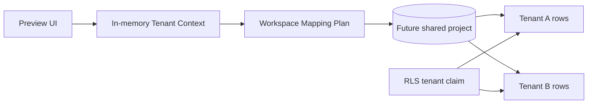

# Multi-Tenant Architecture Report

The proposed topology uses one shared Supabase project and an unlimited logical set of customer workspaces. Every tenant-owned row carries a required `tenant_id`.

Workspace mappings cover authentication profiles, branding, settings, storage prefixes, products, customers, suppliers, invoices, inventory, accounting, and reports. Composite tenant-aware relationships prevent accidental cross-tenant references.

Current implementation is architecture preview only: three mock workspaces, zero live tenants, and no persistence.
