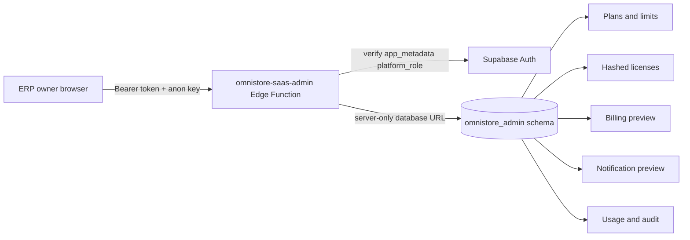

# Phase 28 Implementation Report

Phase 28 adds an isolated SaaS Administration and Licensing package. No POS, Sales, Purchases, Inventory, Accounting, business logic, or Customer Provisioning implementation was changed.

## Architecture

The Edge Function owns all privileged operations. The browser receives neither `service_role` nor `SUPABASE_DB_URL`. The existing tenant owner role is insufficient; only the platform-level `erp_owner` claim is accepted.

## Added capabilities

- Six subscription types: Trial, Monthly, Quarterly, Yearly, Lifetime, and Custom.
- Configurable limits for nine resources.
- Customer activate, suspend, resume, renew, change-plan, reset-password, and workspace-report actions.
- Server-generated licenses with SHA-256 hash storage, validation, renewal, revocation, expiration status, and audit.
- Billing invoice/payment/renewal/history preview without a payment gateway.
- Preview notifications for license expiration, storage/plan limits, inactivity, and failed provisioning.
- Thirteen owner-only Reports pages.

No administration request runs on page load. Initialization and subsequent actions require an explicit user click and an authenticated ERP owner session.
