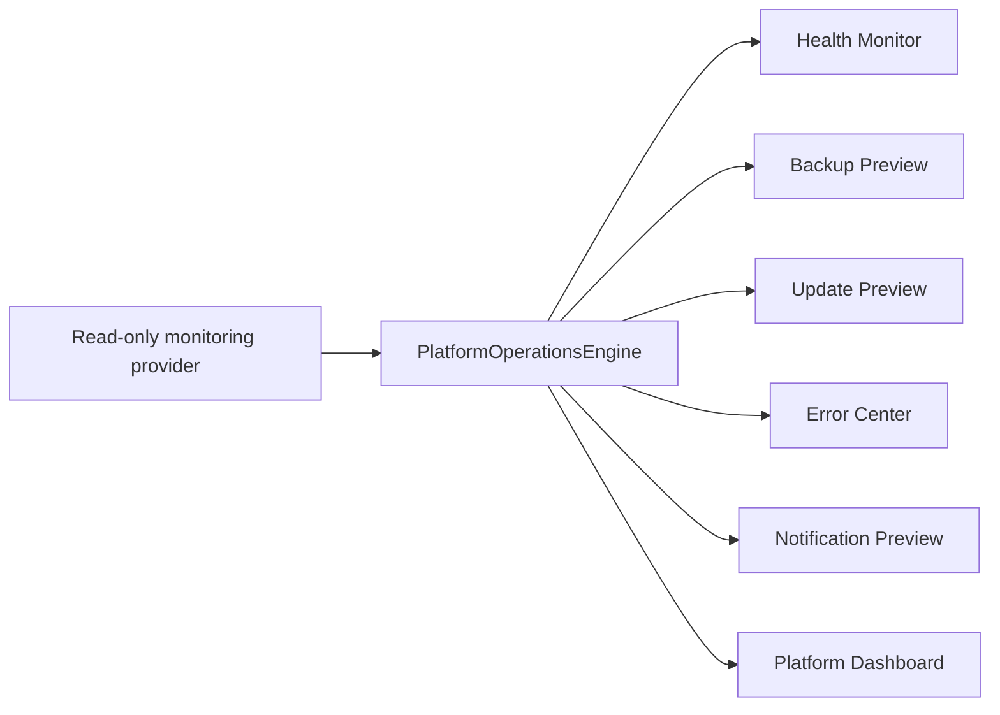

# Phase 29 Platform Operations Report

Phase 29 adds an isolated Platform Operations Center. It does not import or modify Accounting, Inventory, POS, Sales, Purchases, Licensing, Provisioning, Deployment, or business logic.

## Architecture

The engine accepts snapshots through an injected `readSnapshot()` provider. It creates no database, Supabase, HTTP, WebSocket, backup, restore, or update connection itself.

Health covers CPU, memory, storage, database size, workspace, API, Edge Function, Realtime, Storage, and connection status. Backups and updates remain preview-only.
