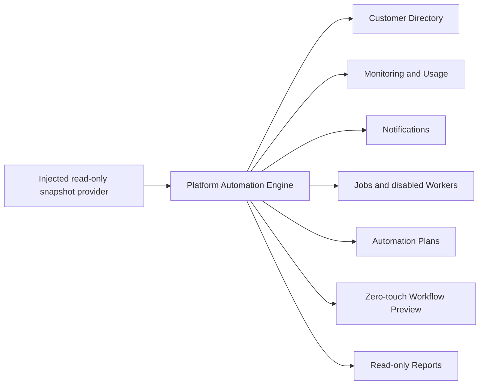

# Phase 31 Self-Managed ERP Platform

Phase 31 adds the isolated `services/platformAutomation/` package and 19 administration pages. Existing Accounting, Inventory, Sales, Purchases, POS, business logic, customer data, posting, Reports logic, and database logic were not changed.

## Architecture

The package has no network, Supabase, SQL, deployment, provisioning, licensing, posting, localStorage, or database executor.

## Administration pages

Platform Dashboard, Customers, Subscriptions, Licenses, Deployments, Updates, Backups, Monitoring, Audit Logs, System Health, Notifications, Jobs Queue, Workers, Storage Usage, Database Usage, API Usage, Edge Functions, Automation, and Platform Reports.

All customer actions are workflow plans. Delete requires a tenant-specific confirmation contract but still has no executor.
