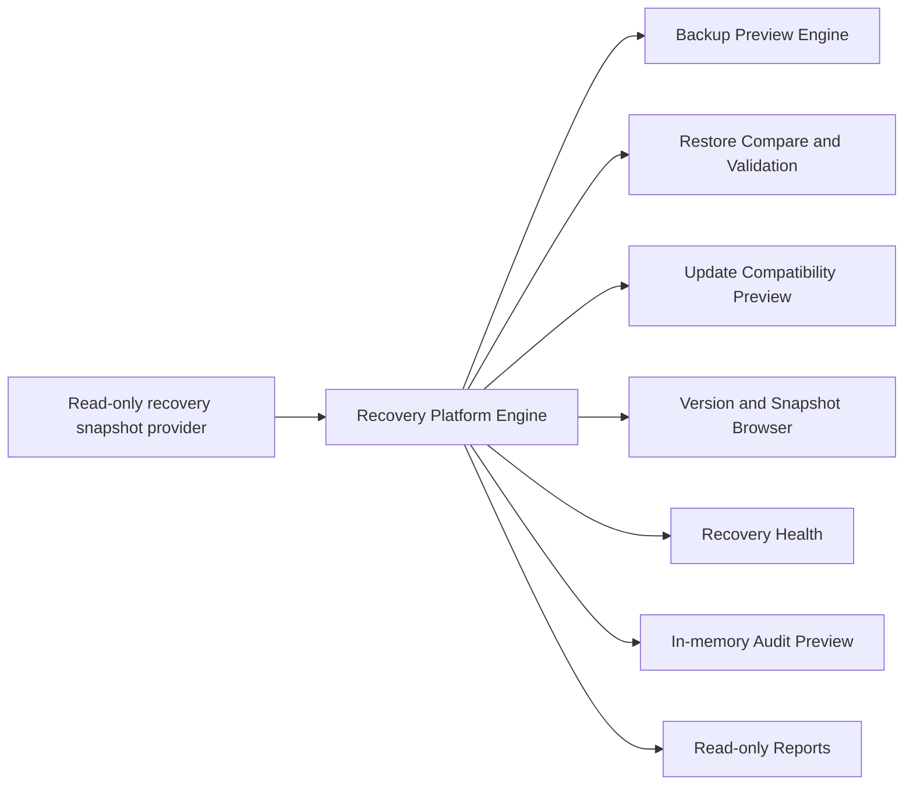

# Phase 32 Recovery Platform

Phase 32 adds the isolated `services/recoveryPlatform/` package and nine administration pages. No Accounting, Inventory, Sales, Purchases, POS, Posting, business logic, customer data, Supabase data, Authentication, Licensing, or Provisioning implementation was changed.

## Architecture

There is no backup writer, restore executor, update installer, SQL executor, Supabase client, file writer, or customer-data mutation path.
