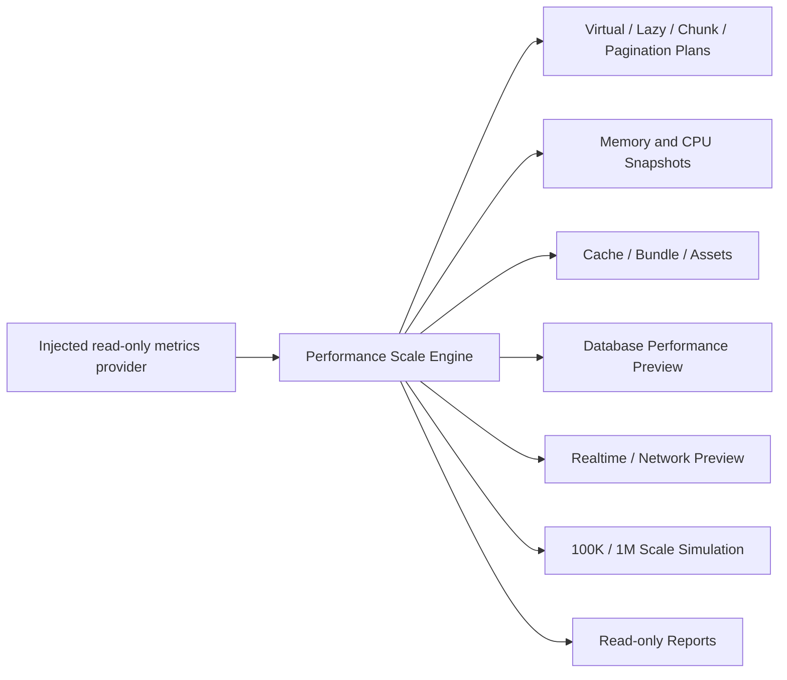

# Phase 33 Performance & Scale

Phase 33 adds the isolated `services/performanceScale/` package and ten Reports pages. It does not modify Accounting, Inventory, Sales, Purchases, POS, Posting, Licensing, Authentication, Provisioning, customer data, Supabase data, or business behavior.

## Architecture

The package contains no SQL executor, Supabase client, Worker constructor, network connection, cache mutation, database writer, or business-module import.
