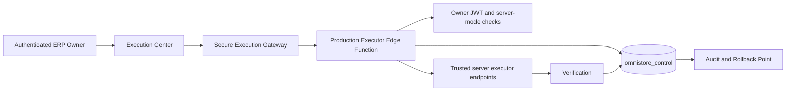

# Phase 34 Controlled Production Execution

Phase 34 adds `services/productionExecution/`, the protected `omnistore-production-executor` Edge Function, an isolated `omnistore_control` schema definition, and six administration pages.

Production Mode defaults to OFF in both browser memory and server state. The layer modifies no Accounting, Inventory, Sales, Purchases, POS, Posting, or business logic.

## Architecture

The browser never receives service-role, database, or executor credentials. Executor endpoints and tokens are server environment values.
