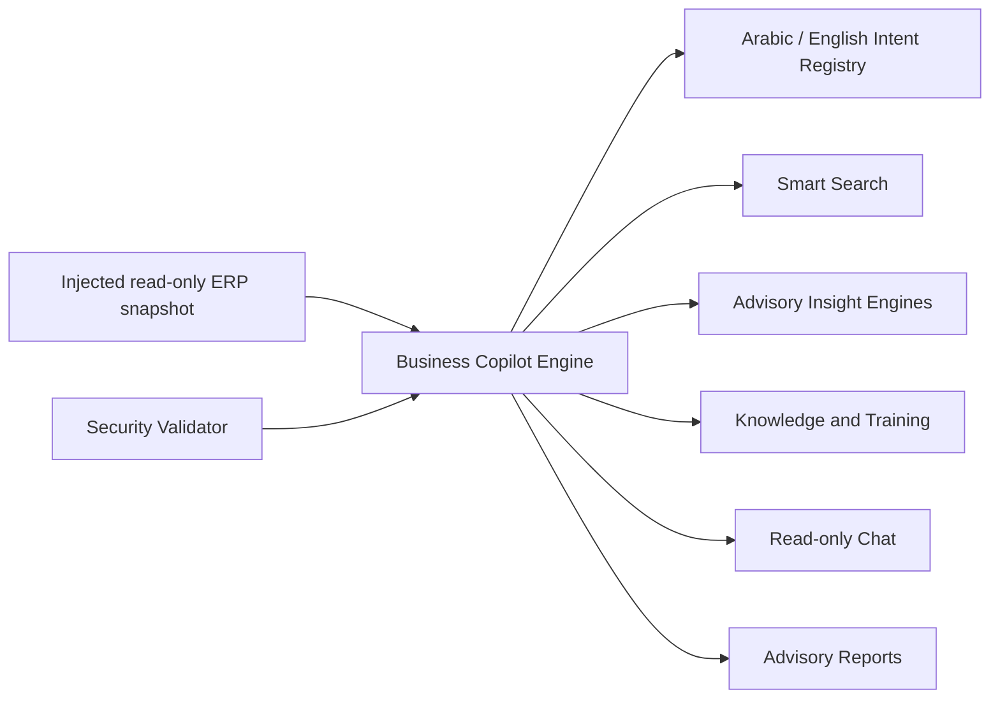

# Phase 35 AI Business Copilot

Phase 35 adds the isolated `services/aiCopilot/` package and twelve Analytics pages. No Accounting, Inventory, Sales, Purchases, POS, Posting, business logic, Supabase logic, or Production Mode implementation was changed.

## Architecture

The package uses no external model, API key, fetch, SQL, Supabase client, write method, posting method, or business-module import.
