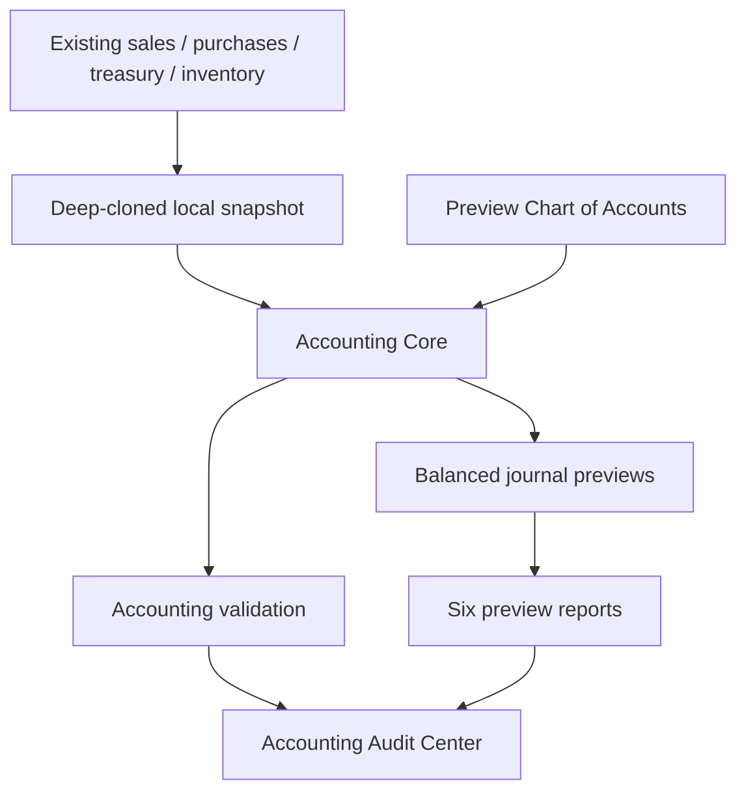

# Phase 6 — Accounting Core Safety Layer

Date: 2026-06-29

## Outcome

OmniStore now has an independent accounting safety module that simulates journal effects, validates local operational data, and renders six accounting previews. It is additive and read-only.

No SQL was executed. Supabase configuration and code were not modified. No migration or data write was introduced.

## Architecture



## New files

- `services/accountingCore/chartOfAccounts.js`
- `services/accountingCore/accountingCore.js`
- `services/accountingCore/accountingReports.js`
- `services/accountingCore/accountingUi.js`
- `services/accountingCore/README.md`
- `services/accountingCore/tests/accountingCore.test.js`
- `services/accountingCore/tests/accountingIntegration.test.js`
- `PHASE6_IMPLEMENTATION_REPORT_20260629.md`
- `PHASE6_TEST_REPORT_20260629.md`
- `PHASE6_ROLLBACK_REPORT_20260629.md`

## Modified files

- `DigiTronics_v5.html`
  - Added the Accounting Audit Center page.
  - Added a deep-cloned, read-only snapshot adapter.
  - Added the page render hook and `viewFinancial` access rule.
  - Loaded the accounting services.
- `services/modulePlatform/moduleRegistry.js`
  - Registered `accounting_core` with route, permission, navigation, widget and safe defaults.
- `sw.js`
  - Added accounting assets and bumped the app-shell cache version.

## Added capabilities

- Preview chart of accounts.
- Sale and purchase Debit/Credit simulation.
- Balanced journal validation.
- Missing-cost, missing-product-link, invalid treasury direction, inventory-cost, negative-stock and overselling checks.
- Trial Balance, P&L, inventory valuation, treasury reconciliation, sales-profit and purchase-cost reports.
- Filterable Accounting Audit Center.
- Per-invoice journal preview.
- Read-only audit JSON export.

## Compatibility

- Existing tables and object keys were not renamed.
- Existing sales, purchases, inventory and treasury functions were not replaced.
- The default `computer_shop` behavior remains unchanged.
- The module is available to roles with `viewFinancial`.
- No breaking changes are intended or detected.

## How to test

1. Open `DigiTronics_v5.html`.
2. Sign in as Owner, Admin or Manager.
3. From Reports, open **مركز المراجعة المحاسبية**.
4. Confirm the page shows “قراءة فقط”.
5. Review issue filters and all six reports.
6. Click **معاينة القيد** on a sale and purchase.
7. Confirm Debit equals Credit.
8. Run:

```powershell
node --test services/accountingCore/tests/*.test.js
```

## Errors found

No existing OmniStore data was changed or auto-corrected. Fixture tests correctly detected missing cost, missing product links, negative stock and sales exceeding available stock.

Real local browser data is intentionally evaluated only when the user opens the Audit Center; findings are displayed locally and are not persisted.

