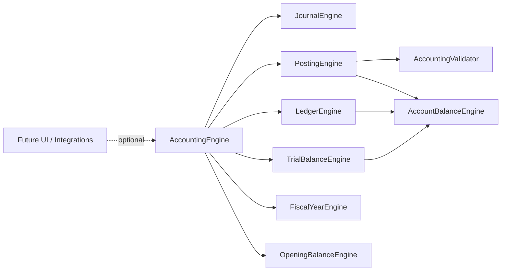

# Phase 8 Implementation Report — Enterprise Accounting Engine

Date: 2026-06-29

## Scope

Implemented Phase 8 as a standalone, modular, in-memory accounting engine.

No SQL was executed.
No Supabase files were modified.
No migrations were created.
No existing OmniStore/DigiTronics feature files were changed.

## New Files

- `services/accounting/AccountingEngine.js`
- `services/accounting/JournalEngine.js`
- `services/accounting/LedgerEngine.js`
- `services/accounting/PostingEngine.js`
- `services/accounting/VoucherEngine.js`
- `services/accounting/TrialBalanceEngine.js`
- `services/accounting/FiscalYearEngine.js`
- `services/accounting/AccountBalanceEngine.js`
- `services/accounting/OpeningBalanceEngine.js`
- `services/accounting/AccountingValidator.js`
- `services/accounting/README.md`
- `services/accounting/DEVELOPER_GUIDE.md`
- `services/accounting/tests/accountingEngine.test.js`
- `PHASE8_IMPLEMENTATION_REPORT_20260629.md`
- `PHASE8_TEST_REPORT_20260629.md`
- `PHASE8_ROLLBACK_REPORT_20260629.md`

## Modified Existing Files

None.

## What Was Added

- Enterprise Chart of Accounts coverage.
- Professional voucher and journal-line model.
- Validation layer for balance, account existence, closed fiscal periods/years, inactive accounts, read-only accounts, currency, exchange rate, and permissions.
- In-memory posting, unposting, reversing, preview, and simulation.
- Ledger with opening balance, debit totals, credit totals, running balance, and closing balance.
- Trial Balance before and after posting.
- Opening balance voucher generator.
- Fiscal year and period close/reopen support.
- Audit log events for create, edit, delete/soft remove, post, unpost, and reverse.
- Role permissions for Owner, Admin, Accountant, Auditor, Manager, and Cashier.
- Business-profile neutral filtering for all current and future activities.

## Backward Compatibility

The engine is not injected into `DigiTronics_v5.html` or `sw.js`, so existing Products, Sales, Purchases, Inventory, Treasury, Reports, Repairs, Supabase diagnostic, Accounting Core, and Accounting Rules screens remain untouched.

## Architecture Diagram



## How To Test

If Node.js is available:

```powershell
node E:\Projects\ESO\services\accounting\tests\accountingEngine.test.js
```

The same assertions were also executed through the Codex JavaScript runtime because `node` is not available in the current PowerShell PATH.
