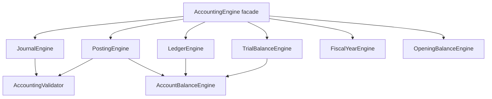

# OmniStore Enterprise Accounting Engine

Phase 8 adds a standalone accounting engine under `services/accounting/`.

It is intentionally independent from the current OmniStore UI, DigiTronics logic, Supabase, SQL, and migrations. All operations are in-memory simulations unless a future integration layer explicitly persists the returned state.

## Architecture

## Modules

- `AccountingEngine.js`: facade and default Chart of Accounts.
- `JournalEngine.js`: professional voucher and journal-line model.
- `VoucherEngine.js`: voucher numbering, create/edit/soft remove helpers, and audit events.
- `PostingEngine.js`: `post`, `unPost`, `reverse`, `preview`, `simulation`.
- `LedgerEngine.js`: account ledgers with opening, debit, credit, running, and closing balances.
- `TrialBalanceEngine.js`: trial balance before/after posting with filters.
- `FiscalYearEngine.js`: fiscal years, periods, close/reopen year and period.
- `AccountBalanceEngine.js`: account balance snapshots and before/after preview.
- `OpeningBalanceEngine.js`: opening cash, bank, inventory, customer, supplier, and equity-offset vouchers.
- `AccountingValidator.js`: balance, account, fiscal year, account status, read-only, currency, and permission validation.

## Chart of Accounts Coverage

The default chart covers:

- Assets, Current Assets, Fixed Assets
- Liabilities, Current Liabilities, Long Term Liabilities
- Equity
- Revenue
- Cost Of Sales
- Expenses
- Other Income
- Other Expense
- Tax Accounts
- Discount Accounts
- Inventory Accounts
- Cash Accounts
- Bank Accounts
- Customer Accounts
- Supplier Accounts

## Voucher Model

Each voucher contains:

- `voucherNumber`
- `voucherType`
- `postingDate`
- `reference`
- `description`
- `businessProfile`
- `lines[]`

Each line contains:

- `account`
- `debit`
- `credit`
- `currency`
- `exchangeRate`
- `costCenter`
- `branch`
- `project`
- `notes`

## Validation Rules

The engine rejects posting when:

- Debit does not equal Credit.
- An account does not exist.
- The fiscal year or period is closed.
- The account is inactive.
- The account is read-only.
- Currency or exchange rate is missing/invalid.
- The role does not have permission.

## Business Profiles

The engine stores `businessProfile` on vouchers and filters reports by it. There is no hard-coded business-specific `if/else`, so it works with `computer_shop`, `restaurant`, `pharmacy`, `auto_parts`, `supermarket`, `clothes`, and future profiles.

## Persistence Boundary

No SQL, Supabase, migrations, localStorage, or external writes are used. Returned state is in-memory only.
