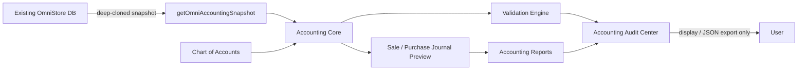

# OmniStore Accounting Core Safety Layer

## Scope

Phase 6 is a local, read-only accounting simulation. It reviews current sales, purchases, treasury movements, inventory and expenses without recording journal entries or modifying OmniStore data.

It does **not** call Supabase, execute SQL, create migrations, write to `localStorage`, or call `saveDB()`.

## Architecture



### Files

- `chartOfAccounts.js`: preview chart of accounts and normal debit/credit sides.
- `accountingCore.js`: normalization, cost lookup, journal simulation and validation.
- `accountingReports.js`: the six preview reports.
- `accountingUi.js`: read-only Audit Center renderer.
- `tests/`: unit and integration coverage.

The browser adapter creates a new JSON-safe object. The accounting services clone their own input again before a full audit. No returned preview contains a persistence method.

## Chart of Accounts

| Code | Account |
|---|---|
| 1000 | Cash / Treasury |
| 1100 | Accounts Receivable |
| 1200 | Inventory Asset |
| 2000 | Accounts Payable |
| 3000 | Retained Earnings |
| 4000 | Sales Revenue |
| 5000 | Cost of Goods Sold |
| 5100 | Purchase Expense |
| 5200 | Operating Expense |
| 5300 | Inventory Adjustment |

`Purchase Expense` is defined for future direct-expense classification. Product purchases in this phase are capitalized to `Inventory Asset`.

## Accounting flow

### Sale preview

Cash sale:

1. Debit Cash / Treasury.
2. Credit Sales Revenue.
3. Debit Cost of Goods Sold.
4. Credit Inventory Asset.

Credit sale uses Accounts Receivable instead of Cash.

### Purchase preview

Cash purchase:

1. Debit Inventory Asset.
2. Credit Cash / Treasury.

Credit purchase uses Accounts Payable instead of Cash.

## Profit calculation

For each sale item:

`item cost = quantity × unit purchase cost`

`gross profit = net sales revenue − cost of goods sold`

`preview net profit = gross profit − operating expenses`

The cost lookup accepts the legacy item and product fields (`buyPrice`, `purchasePrice`, `cost`, `unitCost`). If a sold item has no positive cost, its profit is returned as `null`, and the report is marked unreliable. OmniStore never invents a zero-cost profit.

## Inventory valuation

`inventory value = accounting stock × unit purchase cost`

The snapshot adapter reconstructs quantity stock from linked purchases, sales and returns without clamping a negative result. Available serials are added. A negative stock result is a warning, and a related sale is flagged as exceeding available stock.

Products with positive stock and no cost are listed separately and excluded from a reliable profit conclusion.

## Validation rules

- Sale and purchase previews must balance within `0.01`.
- Sale and purchase items must link to an existing product.
- Sold products require a positive cost before profit is trusted.
- Negative inventory and sales that create it are flagged.
- Treasury movements require a recognized direction and positive amount.
- Recorded running treasury balances are compared with calculated balances.
- Stock-out movements without a verifiable cost are flagged.

## Reports

- Trial Balance Preview
- Profit and Loss Preview
- Inventory Valuation Preview
- Cash Movement Reconciliation
- Sales Profit Audit
- Purchase Cost Audit

All reports are calculated on demand and are not stored.

## What is not activated

- No posted journal ledger.
- No database chart-of-accounts tables.
- No period closing or opening balances.
- No tax posting.
- No depreciation posting.
- No automatic correction of invoices, stock or treasury.
- No Supabase synchronization.

The next accounting phase can consume the preview format only after a separately reviewed persistence design and migration plan.

## Run tests

With Node.js available:

```powershell
node --test services/accountingCore/tests/*.test.js
```

Open OmniStore, sign in as Owner/Admin/Manager, then choose **مركز المراجعة المحاسبية** from Reports. Check summary cards, issue filters, both invoice previews, Trial Balance, P&L, inventory valuation and treasury reconciliation.

