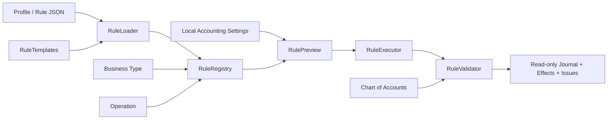

# OmniStore Accounting Rules Engine

## Purpose

Phase 7 moves accounting behavior into declarative rules selected by business type, operation and company settings. The engine creates previews only. It has no posting, persistence, Supabase or SQL capability.

## Architecture



## Components

- `ruleTemplates.js`: 15 reusable operation templates.
- `businessAccountingProfiles.js`: 12 built-in profiles compiled to 180 rules.
- `ruleRegistry.js`: profile/rule lookup, aliases and lifecycle.
- `ruleLoader.js`: JSON parsing, validation, materialization and registration.
- `ruleValidator.js`: rule contract and accounting validation.
- `ruleExecutor.js`: declarative line evaluation and effect calculation.
- `rulePreview.js`: public orchestration API.
- `accountingRulesSettings.js`: isolated local settings only.
- `accountingRulesUi.js`: Accounting Configuration and Simulator.
- `profiles/*.json`: editable profile manifests.
- `sdk/`: schemas and examples.

## Flow

1. `RuleRegistry.boot()` registers the bundled profiles.
2. `RulePreview.preview(businessType, operation, context, settings)` resolves the profile and rule.
3. `RuleExecutor` evaluates amount tokens and account mappings.
4. `RuleValidator` checks accounts, balance, cost, stock, currency, tax and discount.
5. The caller receives an immutable-style result with `preview: true`, `readOnly: true`, and `persisted: false`.

No step calls `saveDB`, Supabase or a journal repository.

## Built-in profiles

`computer_shop`, `mobile_shop`, `car_parts`, `electronics`, `restaurant`, `pharmacy`, `clothes`, `supermarket`, `hardware`, `furniture`, `beauty`, `general_store`.

Compatibility aliases include `auto_parts → car_parts`, `fashion → clothes`, `grocery → supermarket`, and `generic_store → general_store`.

## Built-in operations

Sales, Purchase, Purchase Return, Sales Return, Expense, Income, Inventory Adjustment, Opening Balance, Closing Balance, Treasury Deposit, Treasury Withdraw, Customer Payment, Supplier Payment, Internal Transfer and Manual Journal.

Every compiled rule contains:

- Rule Name / Rule ID / Description / Enabled.
- Required Accounts / Affected Modules / Validation Rules.
- Journal Preview.
- Inventory / Cash / Tax / Profit impact descriptions.

## Amount tokens

JSON journal lines can use:

- `amount`
- `discount`
- `tax`
- `net_amount` = amount − discount + tax
- `discounted_amount` = amount − discount
- `purchase_inventory` = amount − discount
- `inventory_cost` = resolved unit cost × quantity

Dynamic account tokens include `cash_or_receivable`, `cash_or_payable`, `source_account` and `destination_account`.

## Validation

The engine validates:

- every required and rendered account exists;
- Debit equals Credit within `0.01`;
- positive cost and quantity where required;
- available stock unless negative stock is allowed;
- operation currency equals company currency;
- tax is non-negative, not greater than amount and matches a supplied rate;
- discount is between zero and amount;
- manual journals contain lines;
- internal-transfer accounts are different.

Disabling Accounting Validation skips optional business checks but keeps account and balance safety checks.

## Settings

The only persisted Phase 7 value is:

`omnistore_accounting_rules_settings_v1`

It stores Default Accounts, Default Tax, Inventory Method, Profit Calculation Method, Allow Negative Stock, Auto Journal Preview, Enable Accounting Validation and Currency.

It is separate from `cairo_db_v7` and does not contain operational or journal data.

## Preview API

```js
const result = OmniAccountingRulePreview.preview(
  'computer_shop',
  'sale',
  {
    amount: 1000,
    cost: 600,
    quantity: 1,
    tax: 140,
    taxRate: 14,
    discount: 0,
    availableStock: 10,
    currency: 'EGP',
    paymentType: 'cash'
  },
  OmniAccountingRulesSettings.load()
);
```

Read `result.lines`, `result.validation`, and `result.effects`. Never treat a preview as a posted journal.

## Tests

```powershell
node --test services/accountingRules/tests/accountingRules.test.js
```

The suite covers sales, purchase, returns, inventory, treasury, tax, discount, profit, validation, preview, Registry, Loader and all 180 compiled rules.

