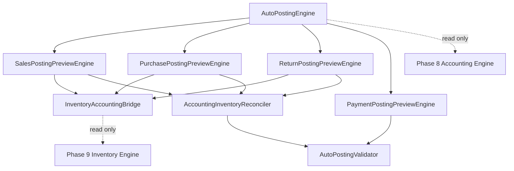

# OmniStore Auto Posting Preview Engine

Phase 10 adds an isolated read-only engine for Sales and Purchase Auto Posting Preview.

It generates accounting previews and inventory impact previews only. It does not save, post, update inventory, update accounting, create SQL, or touch Supabase.

## Files

- `AutoPostingEngine.js`
- `SalesPostingPreviewEngine.js`
- `PurchasePostingPreviewEngine.js`
- `ReturnPostingPreviewEngine.js`
- `PaymentPostingPreviewEngine.js`
- `InventoryAccountingBridge.js`
- `AccountingInventoryReconciler.js`
- `AutoPostingValidator.js`

## Supported Operations

- Sales Invoice
- Purchase Invoice
- Sales Return
- Purchase Return
- Customer Payment
- Supplier Payment
- Cash Sale
- Credit Sale
- Cash Purchase
- Credit Purchase

## Preview Output

Every preview includes:

- Journal preview
- Debit lines
- Credit lines
- Inventory impact
- Cost impact
- Profit impact
- Cash impact
- Customer/Supplier impact
- Validation errors
- Warnings

## Integration Boundary

The engine can receive Phase 8 and Phase 9 engine instances in context:

```js
const engine = OmniAutoPosting.AutoPostingEngine.createEngine({
  accountingEngine,
  inventoryEngine
});
```

It reads current cost/quantity from the inventory engine and never mutates it.

It does not call `post()` on the accounting engine and never creates vouchers in its state.

## Architecture


