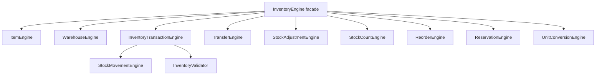

# OmniStore Inventory Engine

Phase 9 adds an isolated inventory engine under `services/inventory/`.

It is not wired into the existing DigiTronics UI. It does not modify POS, Sales, Purchases, Manufacturing, Inventory UI, Business Profiles, Authentication, Permissions, Reports, Supabase, SQL, migrations, `DigiTronics_v5.html`, `sw.js`, or `manifest.json`.

## Modules

- `InventoryEngine.js`: facade for all inventory operations.
- `ItemEngine.js`: item master data and tracking flags.
- `WarehouseEngine.js`: multi-warehouse definitions.
- `StockMovementEngine.js`: normalized movement records.
- `InventoryTransactionEngine.js`: receipt, issue, on-hand, committed, available, FIFO, average cost.
- `TransferEngine.js`: warehouse-to-warehouse transfers.
- `StockAdjustmentEngine.js`: target quantity adjustments.
- `StockCountEngine.js`: stock count creation and application.
- `ReorderEngine.js`: reorder suggestions.
- `InventoryValidator.js`: item, warehouse, serial, batch, expiry, and stock checks.
- `ReservationEngine.js`: committed quantity and release handling.
- `UnitConversionEngine.js`: unit conversions to/from item base unit.
- `InventoryUtils.js`: clone, rounding, state, and audit helpers.

## Supported Concepts

- Multi Warehouse support.
- FIFO support.
- Average Cost support.
- Batch/Lot support.
- Serial Number support.
- Expiry Date support.
- Reservation support.
- Available Qty.
- On Hand Qty.
- Committed Qty.
- Audit Log.
- Unit Conversion.

## Read-Only Integration Boundary

All state is in-memory and returned to the caller. There is no persistence adapter and no external write.

No `fetch`, `localStorage`, Supabase, SQL, or migrations are used.

## Architecture

