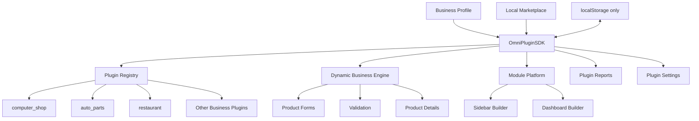

# OmniStore Business Plugin SDK — Developer Guide

## Purpose

Phase 5 turns every Business Type into an isolated folder plugin. Plugins extend the existing OmniStore platform without editing DigiTronics transaction logic.

## Architecture



## Folder contract

```text
plugins/business/my_business/
├── manifest.json
└── plugin.js
```

`manifest.json` is static discovery metadata. `plugin.js` registers the complete runtime contract.

Every registered plugin contains:

- metadata
- loader (`register`, `boot`, `shutdown`)
- routes
- sidebar navigation
- dashboard cards
- permissions
- product schema
- validation definitions
- report definitions
- hooks
- feature flags
- icons
- Arabic and English translations
- sample/default settings
- activity master data

## Manifest

```json
{
  "id": "pet_store",
  "name": "Pet Store",
  "version": "1.0.0",
  "entry": "plugin.js",
  "businessType": "pet_store",
  "dependencies": [],
  "minPlatformVersion": "5.0.0",
  "languages": ["ar", "en"]
}
```

## Add a module in less than five minutes

### 1. Copy a plugin folder

Copy `plugins/business/generic_store` to `plugins/business/pet_store`.

### 2. Edit the manifest

Change `id`, `name`, `businessType`, and version.

### 3. Define the plugin

```js
(function (root) {
  'use strict';

  root.OmniPluginSDK.register(root.OmniPluginSDK.defineBusinessPlugin({
    id: 'pet_store',
    name: 'متجر الحيوانات',
    version: '1.0.0',
    icon: '🐾',
    description: 'Pets, food and veterinary products.',

    productFields: [
      {
        key: 'pet_type',
        label: 'Pet Type',
        type: 'select',
        options: ['cat', 'dog', 'bird'],
        required: true,
        table: true
      },
      { key: 'age_months', label: 'Age (months)', type: 'number' }
    ],

    validation: {
      product: [{ field: 'pet_type', rule: 'required' }]
    },

    permissions: [
      'products.read',
      'products.write',
      'orders.create',
      'inventory.adjust',
      'reports.view'
    ],

    dashboardCards: [
      {
        id: 'pet_store.products',
        labelKey: 'products',
        icon: '🐾',
        route: 'products',
        metric: 'product_count'
      }
    ],

    reports: [
      {
        id: 'pet_store.inventory',
        labelKey: 'inventory_report',
        metric: 'stock_value',
        route: 'reports'
      }
    ],

    masterData: {
      categories: ['Pets', 'Food', 'Accessories'],
      brands: [],
      units: ['قطعة', 'عبوة'],
      tags: ['Vaccinated', 'Imported']
    },

    translations: {
      ar: { name: 'متجر الحيوانات' },
      en: { name: 'Pet Store' }
    },

    sampleSettings: {
      vaccinationTracking: true
    },

    featureFlags: {
      pets: true
    }
  }));
})(typeof globalThis !== 'undefined' ? globalThis : window);
```

### 4. Load it

Add its `plugin.js` after `pluginSdk.js` in the application and add both manifest/plugin files to `sw.js` for offline support.

### 5. Add the Business Type

Add the ID to the Business Profile selector and compatibility list. The SDK handles forms, validation, settings, marketplace, reports, Sidebar, and Dashboard.

## Supported product controls

- text
- number
- select
- checkbox
- textarea
- date
- serial
- barcode
- currency

## Storage

Plugin installation, enabled state, and settings use:

`omnistore_business_plugins_v1`

No plugin uses SQL or Supabase.

Product values continue to use the existing local product records:

- compatibility fields can use top-level properties with `storage: "direct"`
- all other fields use `product.customFields`

## Lifecycle

```text
register() → install() → enable() → boot()
                                  ↓
                             active plugin
                                  ↓
                     disable() / uninstall()
                                  ↓
                              shutdown()
```

The SDK activates the installed/enabled plugin matching the current Business Type or one of its aliases.

## Hooks

- `onInstall`
- `onUninstall`
- `onEnable`
- `onDisable`
- `onBusinessActivated`

Hooks receive `{ sdk, plugin, state }` and must remain local unless the product explicitly adds an approved external integration later.

## Permissions

Permissions are namespaced strings, for example:

- `products.read`
- `products.write`
- `orders.create`
- `inventory.adjust`
- `reports.view`
- `batches.manage`
- `kitchen.manage`

Use `OmniPluginSDK.hasPermission(permission)` for active-plugin capability checks. Existing application role checks remain authoritative for legacy operations.

## Localization

Every plugin must provide:

```js
translations: {
  ar: { name: '...' },
  en: { name: '...' }
}
```

Use:

```js
OmniPluginSDK.translate(pluginId, key, language);
```

## SDK API

- `defineBusinessPlugin(config)`
- `validatePlugin(plugin)`
- `register(plugin)`
- `listPlugins()`
- `getPlugin(id)`
- `getPluginState(id)`
- `getActivePlugins()`
- `install(id)`
- `uninstall(id)`
- `enable(id)`
- `disable(id)`
- `bootActive()`
- `getSettings(id)`
- `updateSettings(id, patch)`
- `translate(id, key, language)`
- `getPermissions()`
- `hasPermission(permission)`
- `getRoutes()`
- `isRouteAvailable(route)`
- `reset()`

## Testing

```powershell
node --test services/pluginSdk/tests/pluginSdk.unit.test.js
node --test services/pluginSdk/tests/pluginPlatform.integration.test.js
```

Before publishing a plugin, verify:

1. Manifest parses.
2. Contract validation passes.
3. Arabic and English exist.
4. Required product validation works.
5. Enable/disable/install/uninstall works.
6. Product form renders.
7. Sidebar and Dashboard contributions appear.
8. Reports and settings stay isolated.

## Backward compatibility

The Phase 3 Business Registry remains as fallback. If a plugin is disabled or uninstalled, its custom schema is unregistered and OmniStore safely falls back without deleting products or settings.

Existing DigiTronics functions and operational records are not removed or renamed.
